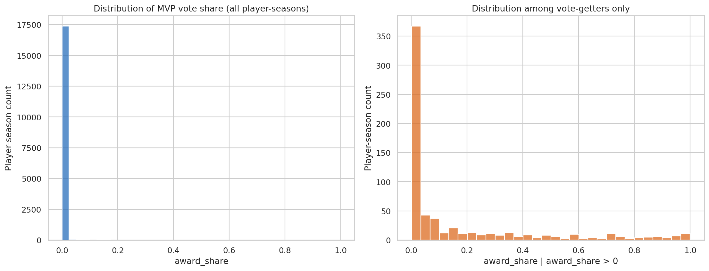
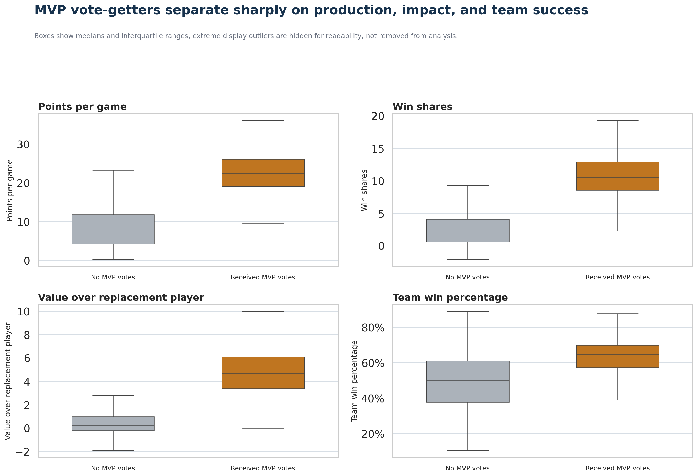
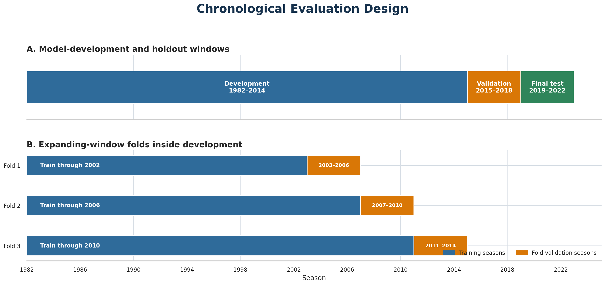
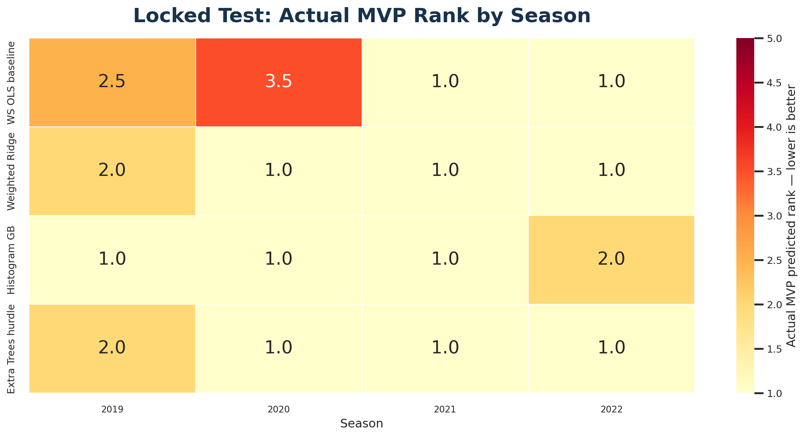
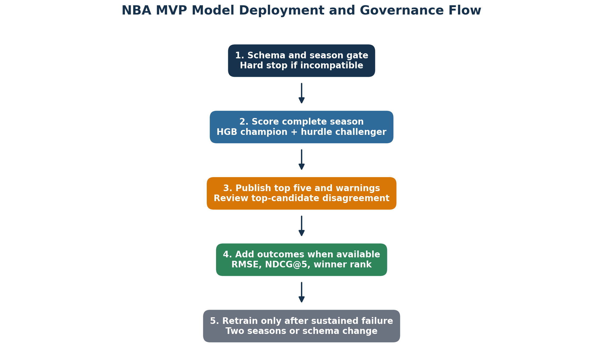

# Can Player Statistics Predict the NBA MVP Vote?

## A leakage-resistant CRISP-DM study of vote-share regression and season-level candidate ranking, 1982–2022

Every spring, NBA Most Valuable Player debates turn statistics into stories. Scoring, efficiency, playmaking, defense, availability, team record, and historical precedent all enter the conversation. That makes MVP voting an unusually interesting data-science problem: the output is numerical, but the process that creates it is human.

I asked a deliberately stricter question than “Can a model name the winner?”

> Can regular-season player statistics and team performance predict each player’s numerical MVP vote share—and correctly rank the candidates within each season?

The distinction matters. A winner-only classifier throws away information about the ballot. A conventional regression can look excellent by predicting almost everyone near zero, yet still rank the true MVP poorly. A useful solution therefore has to succeed at two tasks simultaneously:

1. estimate the continuous target, `award_share`; and
2. order the leading candidates correctly within each season.

Using a chronological, leakage-controlled design, the final weighted Histogram Gradient Boosting model reached an all-player RMSE of **0.0263**, vote-recipient RMSE of **0.1553**, and mean **NDCG@5 of 0.8934** on the untouched 2019–2022 test seasons. It ranked the actual MVP first in three of four seasons and second in the remaining season.

Those results are promising. They are not proof that an algorithm has solved MVP voting. The most important lesson is more nuanced: regular-season performance contains strong predictive signal, but model quality depends on treating time, sparsity, ranking, and human-label uncertainty as first-class design problems.

---

## The data

The analysis uses Robert Sunderhaft’s Kaggle dataset, [1982–2022 NBA Player Statistics with MVP Votes](https://www.kaggle.com/datasets/robertsunderhaft/nba-player-season-statistics-with-mvp-win-share).

The uploaded file contains:

- **17,697** player-team-season rows;
- **55** columns;
- **41 seasons**, from 1982 through 2022;
- conventional box-score measures;
- advanced metrics such as PER, Win Shares, BPM, and VORP;
- team winning percentage and margin variables; and
- the continuous MVP target, `award_share`.

This is a useful teaching dataset because its difficulty is not hidden. **96.29% of rows have zero award share.** Traded players generate `TOT` aggregate rows. Player names repeat. Shooting percentages can be undefined when a player has no attempts. League scoring environments change across four decades. Many advanced metrics are strongly correlated.



*Figure 1. The target is zero-inflated: ordinary players dominate the row count, while meaningful vote shares occupy a small tail. A model must learn both the candidate boundary and the size of support among candidates.*

---

## CRISP-DM as the organizing framework

I used CRISP-DM because it forces the project to begin with the decision problem rather than the algorithm.

### 1. Business understanding

The model is an analytical aid, not an objective definition of value. Its intended output is a season-specific candidate table with predicted vote shares, ranks, uncertainty warnings, and a comparison between two independently structured models.

The success criteria were declared before opening the final test:

- beat a Win Shares baseline on all-player RMSE;
- beat it on vote-recipient RMSE;
- beat it on NDCG@5;
- rank the winner third or better on average;
- achieve at least 50% top-1 accuracy; and
- improve season-total vote-share calibration.

### 2. Data understanding

The initial audit checked schema, missingness, exact duplicates, repeated season-player-team keys, `TOT` rows, logical ranges, target sparsity, era shifts, position patterns, extreme values, correlations, and multicollinearity.

One important discipline was to investigate each apparent problem before changing it. For example, repeated player names were not evidence of duplication. They can represent the same player on multiple teams, a `TOT` aggregate, different people with the same name, or legitimate records across seasons. Likewise, an extreme BPM or points-per-game season is often precisely the signal an MVP model needs.

The source audit found no exact duplicate rows and no logical range failures. It did find one repeated season-player-team key involving two distinct Charles Jones records in 1989. Those rows were retained because they are not identical and automatic name-based deduplication could merge different people.

### 3. Data preparation

The main analytical cohort includes players with at least **100 total minutes**. A prespecified sensitivity analysis repeats the final evaluation at **500 minutes**.

Why not filter directly to a small candidate list? Because the negative population is part of the learning problem. The model should learn why a productive rotation player is not an MVP candidate. At the same time, one-minute and ten-minute samples produce unstable rates and contribute little useful information. The 100-minute rule is therefore a modest data-reliability screen rather than a hand-selected shortlist.

The other central preparation decisions were:

- retain `TOT` aggregate rows;
- add an `is_tot` indicator;
- set team context to missing for `TOT` records rather than borrowing one team’s record;
- add flags for structurally missing shooting percentages, then fill their numerical value with zero;
- derive primary position from hybrid position strings;
- use median imputation inside the training pipeline for remaining numeric missingness;
- one-hot encode primary position; and
- preserve plausible statistical outliers.

To make the model more era-aware, I created within-season percentile versions of points per game, minutes per game, true shooting, PER, Win Shares, WS/48, BPM, VORP, and team winning percentage. A raw total from 1985 should not automatically have the same meaning as the same total in 2022.

Most importantly, `award_share` was removed before any feature engineering. Percentiles use only predictor values within a season. Player name and row identifiers are excluded. Preprocessors are fitted inside scikit-learn pipelines on training data only.



*Figure 2. MVP vote recipients occupy distinctive combinations of individual production, advanced impact, and team success. No single metric fully defines the candidate population.*

---

## Why chronological validation is non-negotiable

A random train-test split would be convenient and wrong for this question. It could train on 2021 while testing on 2008, mixing information from later basketball environments into earlier predictions. It would also distribute rows from the same season-level voting context across both sides of the split.

I used three time blocks:

- **development and model selection:** through 2014;
- **validation:** 2015–2018; and
- **locked final test:** 2019–2022.

The later test seasons remained untouched during feature and model selection. After the one-time test evaluation, the final champion and challenger were refit through 2022 for the saved production artifact. That refit does not alter the reported historical test evidence.



*Figure 3. Model selection ends before the final four-season test begins. This preserves the direction of time and prevents later seasons from influencing the chosen specification.*

---

## Models: simple references before complex learners

The comparison started with deliberately simple baselines:

- predict zero for every player;
- predict the historical mean;
- use a one-variable OLS regression on within-season Win Shares percentile.

The serious model set then included weighted Ridge regression, nonlinear tree ensembles, weighted Histogram Gradient Boosting, and two-stage hurdle models. Clustering was used to explore player archetypes and MVP concentration, but it was not included in the final predictive design because it did not add enough out-of-time performance to justify the complexity.

The target imbalance required special care. If every row receives equal influence, a model can minimize error by concentrating on the enormous zero class. I used a continuous training weight:

```text
sample_weight = 1 + 5 × award_share
```

This is intentionally moderate. It gives high-share candidates more influence without discarding ordinary players or converting the continuous outcome into an arbitrary binary label.

The final champion is a weighted Histogram Gradient Boosting regressor. The required challenger is an Extra Trees hurdle model that multiplies:

1. the estimated probability that a player receives any votes; and
2. the estimated award share conditional on receiving votes.

Weighted Ridge remains useful because its structure is simpler and its rankings are competitive, but its calibration is not acceptable for production.

---

## Evaluation must reflect both regression and ranking

I reported three complementary families of measures.

**Vote-share accuracy**

- MAE and RMSE across all eligible players;
- RMSE among actual vote recipients; and
- R² across all eligible players.

**Season-level ranking**

- NDCG@5;
- actual winner’s predicted rank;
- top-1 accuracy; and
- season-level Spearman correlation.

**Calibration and boundary behavior**

- predicted versus actual total award share per season;
- bias on the true winner’s share; and
- the percentage of raw predictions clipped to the valid `[0, 1]` range.

This broader scorecard prevented one attractive number from hiding a serious weakness.

---

## Locked 2019–2022 results

| Model | All-player RMSE ↓ | Recipient RMSE ↓ | R² ↑ | NDCG@5 ↑ | Winner rank ↓ | Top-1 ↑ |
|---|---:|---:|---:|---:|---:|---:|
| **Histogram GB** | **0.0263** | **0.1553** | **0.8033** | 0.8934 | **1.25** | **75%** |
| Extra Trees hurdle | 0.0284 | 0.1688 | 0.7704 | **0.9219** | **1.25** | **75%** |
| Weighted Ridge | 0.0478 | 0.2108 | 0.3474 | 0.8739 | **1.25** | **75%** |
| Win Shares OLS | 0.0583 | 0.3460 | 0.0290 | 0.7195 | 2.00 | 50% |

The champion beat the Win Shares baseline on every prespecified criterion. It correctly placed Giannis Antetokounmpo first in 2019 and 2020, Nikola Jokić first in 2021, and Jokić second in 2022 behind Giannis.



*Figure 4. The serious multivariable models consistently move the actual MVP to the top of the season ranking, unlike trivial baselines.*

The 500-minute sensitivity cohort produced the same 75% top-1 accuracy and 1.25 mean winner rank. Recipient RMSE improved slightly, while all-player RMSE worsened slightly because the remaining cohort is more candidate-dense. The substantive conclusion does not depend on the 100-minute threshold.

---

## Why Histogram Gradient Boosting remains the final choice

The Extra Trees hurdle has the highest NDCG@5 and the best mean season-total calibration. That is a real advantage, not a footnote. Still, Histogram GB is the most defensible overall champion for the stated dual objective:

- it has the lowest all-player and recipient RMSE;
- it explains substantially more variance than Ridge or the domain baseline;
- it ties the strongest models on mean winner rank and top-1 accuracy; and
- it underpredicts winners less severely than the hurdle model.

The hurdle model remains mandatory as a structural challenger. When the two models disagree on the top candidate or share fewer than three names in their top five, the output should be flagged for human review.

The champion also has a notable risk: **84.31% of its test predictions were clipped**, mostly because small negative predictions were mapped to zero. This does not erase the model’s strong RMSE and ranking results, but it means the output distribution should be monitored and the predictions should not be oversold as perfectly calibrated probabilities.

---

## Deployment is a governance process, not a model file

The final artifact contains the champion, challenger components, input contract, feature lists, cohort rule, and training horizon. Before scoring, the pipeline requires:

- every locked raw predictor;
- exactly one season in the scoring table;
- a complete player-season population, not only famous candidates; and
- no target column requirement at prediction time.

Monitoring covers schema, missingness, candidate counts, feature drift, champion/challenger agreement, clipping, and post-outcome metrics. Retraining is not automatic. A schema change or two consecutive completed seasons with material degradation triggers review.



*Figure 5. A season is validated, scored by both models, published with warnings, audited after official voting, and retrained only under a documented rule.*

---

## What the model does not know

The locked test has only four seasons and two unique winners. That is the largest limitation of the final comparison.

The predictors also omit important voting context: injuries, timing, teammate competition, public narratives, media attention, conference strength, voter-specific preferences, and changing eligibility rules. Because the target records human judgment, historical patterns may encode biases rather than timeless basketball truth.

This is a predictive study, not a causal one. A large coefficient, split, or feature importance does not show that changing one statistic would cause voters to change their ballots. Nor should a predicted rank be presented as a verdict on who “deserved” the award.

The next scientifically useful extension is genuinely new-season validation. Seasons after 2022 should be scored with the frozen model before their official shares are joined. They should not be used for retuning and then reported as independent evidence. A newer source must also pass feature-parity, provenance, and overlap checks before it is appended.

---

## Reproducibility

The repository includes the complete incremental Python analysis, a guided notebook, the final evaluation and deployment scripts, saved result tables, selected figures, a verified model artifact, a research-style PDF/DOCX report, a model card, and data-download instructions.

Repository: `<ADD-GITHUB-URL>`

To reproduce the main outputs after downloading the Kaggle data:

```bash
python -m pip install -r requirements.txt
python run_all.py --data data/raw/nba_mvp_stats.zip
```

---

## Final takeaway

Regular-season statistics can predict a substantial portion of MVP vote share and produce strong season-level candidate rankings. The most credible result did not come from choosing the most complicated model. It came from matching the evaluation design to the real task: respecting time, keeping the difficult zero population, emphasizing serious candidates without filtering them by hand, evaluating rankings within seasons, preserving an independent test, and reporting model weaknesses alongside successes.

For this dataset, weighted Histogram Gradient Boosting is the best overall champion. The Extra Trees hurdle is the right challenger. Neither should be mistaken for the electorate—or for basketball truth.

---

*AI-use disclosure: ChatGPT was used as a collaborative assistant for CRISP-DM planning, Python analysis, interpretation, and drafting. The author is responsible for validating the code and outputs, editing the final article into their own voice, and complying with course and publication policies.*
