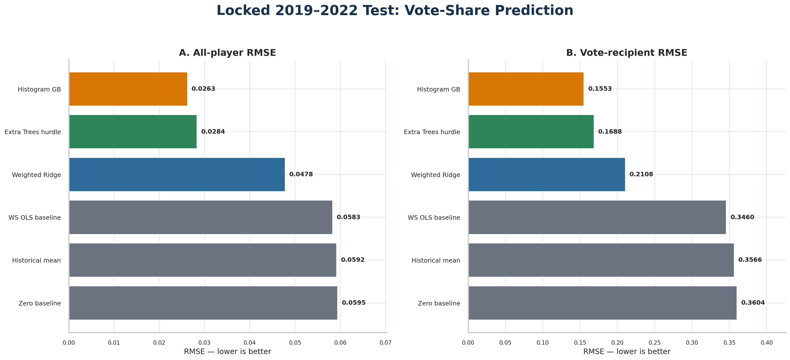
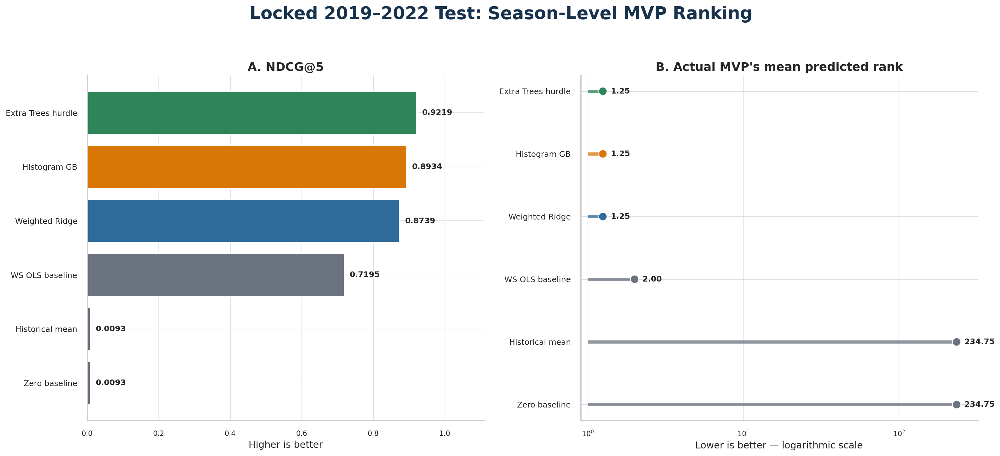

# Predicting NBA MVP Vote Share and Ranking Candidates

This repository applies the CRISP-DM methodology to a historical NBA player-season dataset. The research question is:

> Can regular-season player statistics and team performance predict numerical MVP vote share (`award_share`) and correctly rank MVP candidates within each season?

The answer is cautiously affirmative. On a locked 2019–2022 test period, the selected weighted Histogram Gradient Boosting model achieved an all-player RMSE of **0.0263**, vote-recipient RMSE of **0.1553**, mean **NDCG@5 of 0.8934**, mean winner rank of **1.25**, and top-1 accuracy of **75%**. These results are substantially better than the Win Shares baseline, but the four-season test is too small to support broad claims about every future NBA era.

## Headline results

| Model | All-player RMSE ↓ | Recipient RMSE ↓ | R² ↑ | NDCG@5 ↑ | Winner rank ↓ | Top-1 ↑ |
|---|---:|---:|---:|---:|---:|---:|
| **Weighted Histogram GB** | **0.0263** | **0.1553** | **0.8033** | 0.8934 | **1.25** | **75%** |
| Extra Trees hurdle | 0.0284 | 0.1688 | 0.7704 | **0.9219** | **1.25** | **75%** |
| Weighted Ridge | 0.0478 | 0.2108 | 0.3474 | 0.8739 | **1.25** | **75%** |
| Win Shares OLS baseline | 0.0583 | 0.3460 | 0.0290 | 0.7195 | 2.00 | 50% |

The Histogram GB model remains the official champion because it provides the best vote-share regression performance and the smallest winner-share underprediction among the serious models. The Extra Trees hurdle is retained as a required challenger because it has the best NDCG@5 and season-total calibration. Weighted Ridge is an interpretation and ranking comparator, not the production choice.





## Data source and attribution

- Dataset: [1982–2022 NBA Player Statistics with MVP Votes](https://www.kaggle.com/datasets/robertsunderhaft/nba-player-season-statistics-with-mvp-win-share)
- Kaggle publisher: Robert Sunderhaft
- Local source file: `NBA_Dataset.csv` inside the downloaded ZIP
- Coverage: 17,697 player-team-season rows, 55 columns, 41 seasons (1982–2022)
- Target: `award_share`

The dataset is not redistributed in this repository. Download it from Kaggle and review the terms shown on its dataset page. Full provenance, expected checksum, and download instructions are in [DATA_SOURCE.md](DATA_SOURCE.md).

### Why this dataset?

It joins box-score production, advanced metrics, participation, position, team performance, and historical MVP vote share at the player-season level. It is large enough for chronological development while still exposing realistic problems: 96.29% zero targets, era shifts, traded-player `TOT` rows, repeated names, correlated metrics, missing percentages, and a very small number of annual winners.

## CRISP-DM workflow

1. **Business understanding:** Define success as both numerical vote-share prediction and correct within-season ranking. A model that predicts zeros accurately but misses the winner is not useful.
2. **Data understanding:** Audit schema, duplicates, missingness, target imbalance, `TOT` records, logical ranges, outliers, eras, positions, and statistical relationships.
3. **Data preparation:** Retain players with at least 100 total minutes; preserve the original row identity; flag `TOT` records; avoid inventing team context for `TOT` rows; encode position; add season-relative percentiles; and keep the target outside feature engineering.
4. **Modeling:** Compare zero and historical-mean baselines, Win Shares OLS, weighted Ridge, tree ensembles, weighted Histogram GB, a two-stage hurdle design, and clustering as a diagnostic.
5. **Evaluation:** Select models only with historical development data, then evaluate once on 2019–2022 using regression, ranking, calibration, boundary, and cohort-sensitivity metrics.
6. **Deployment:** Refit the frozen champion and challenger through 2022, validate schemas, score one complete season at a time, monitor drift and model disagreement, and prohibit automatic retraining.


## Important data-quality decisions

| Issue | Decision | Reason |
|---|---|---|
| Extreme target imbalance | Keep all eligible rows; use continuous sample weights `1 + 5 × award_share` | Zero rows define the non-candidate population, but serious candidates need more influence during fitting. |
| Low-participation outliers | Main cohort `mp >= 100`; repeat at `mp >= 500` | Removes unstable tiny samples without narrowing the data to an arbitrary shortlist. All test winners remain in both cohorts. |
| Repeated names | Do not deduplicate by player name | Names can recur across people and seasons; identity requires season/team context. |
| `TOT` rows | Retain; set unavailable team-context fields to missing and add `is_tot` | The aggregate player line is useful, but assigning one traded team’s context to it would be false precision. |
| Missing shooting percentages | Add missingness flags and fill structural undefined values with zero | A player with no attempts has an undefined percentage for a meaningful reason; the flag preserves that distinction. |
| Statistical outliers | Retain plausible elite seasons | MVP prediction is specifically about rare, extreme performance. Removing legitimate stars would erase the signal. |
| Era differences | Add within-season percentile versions of nine central measures | A raw total or rate may mean something different across scoring environments and schedule lengths. |
| Clustering | Use only for descriptive segmentation | Clusters were informative for player archetypes but did not improve locked predictive performance enough to justify extra complexity. |

## Features and leakage controls

The final broad feature set is assembled programmatically from numeric predictors after excluding the target, identifiers, minutes duplicated by derived variables, and selected highly redundant components. It includes:

- participation and demographics: age, games, starts, minutes per game;
- scoring volume and efficiency;
- rebounding, playmaking, defense, turnovers, and fouls;
- advanced impact: PER, Win Shares, WS/48, BPM, VORP, and related rates;
- team performance: adjusted margin and winning percentage where valid;
- position: primary position, one-hot encoded;
- data-quality indicators: `is_tot` and structural-missingness flags;
- era-aware percentiles for points, minutes, true shooting, PER, Win Shares, WS/48, BPM, VORP, and team winning percentage.

`award_share` is removed before any feature engineering. Player name, source row ID, and season labels are not model inputs. Season is used only to create within-season percentiles and chronological splits. Preprocessing is fitted inside scikit-learn pipelines using training data only.

## Chronological validation design

- **Development/model selection:** seasons through 2014
- **Validation:** 2015–2018
- **Locked final test:** 2019–2022
- **Production refit:** 1982–2022, only after the locked evaluation was complete

Random row splitting is prohibited because it would train on later basketball environments while testing on earlier ones and would mix player-seasons from the same voting context across train and test. The later seasons remain separate from model selection.

## Metrics

Regression and ranking are evaluated together:

- MAE and RMSE over all eligible players;
- RMSE among actual vote recipients;
- R² over all eligible players;
- NDCG@5 within each season;
- actual winner’s predicted rank;
- top-1 accuracy;
- season-level Spearman correlation;
- predicted versus actual total vote share;
- winner-share bias and prediction clipping rates.

All six prespecified test criteria passed. Exact tables are in [`results/`](results/).

## Repository structure

```text
part1/
├── README.md
├── DATA_SOURCE.md
├── MODEL_CARD.md
├── requirements.txt
├── run_all.py
├── data/                         # download instructions; raw data ignored
├── models/                       # verified production artifact
├── notebooks/                    # reproducible CRISP-DM notebook
├── reports/
│   ├── medium_article.md         # publication-ready draft
│   ├── NBA_MVP_CRISP_DM_Final_Report.docx
│   ├── NBA_MVP_CRISP_DM_Final_Report.pdf
│   └── figures/                  # selected publication figures
├── results/                      # machine-readable test and deployment outputs
├── src/                          # final evaluation and deployment programs
└── scripts/analysis_chunks/      # complete incremental analysis provenance
```

## Setup

Python 3.11 or newer is recommended.

```bash
git clone https://github.com/MeronDT/CMPE255-Assignment1.git
cd CMPE255-Assignment1/part1
python -m venv .venv
source .venv/bin/activate              # Windows: .venv\Scripts\activate
python -m pip install --upgrade pip
python -m pip install -r requirements.txt
```

Download the Kaggle data as described in [DATA_SOURCE.md](DATA_SOURCE.md), then place it at:

```text
data/raw/nba_mvp_stats.zip
```

## Reproduce the project

Run the schema audit, locked test, and production refit together:

```bash
python run_all.py --data data/raw/nba_mvp_stats.zip
```

Or run each stage separately:

```bash
python src/future_data_schema_audit.py data/raw/nba_mvp_stats.zip \
  --output results/source_schema_audit.json
python src/locked_test_evaluation.py
python src/deployment_readiness.py
```

Open the notebook for a guided reproduction:

```bash
jupyter lab notebooks/nba_mvp_crisp_dm.ipynb
```

The scripts honor these optional environment variables: `NBA_MVP_DATA_PATH`, `NBA_MVP_RESULTS_DIR`, `NBA_MVP_DEPLOYMENT_DIR`, and `NBA_MVP_MODEL_PATH`.

## Principal findings

- Regular-season performance and team context contain strong signal for both MVP vote share and candidate ordering.
- The best regression model is not automatically the best ranker: Histogram GB leads regression, while the Extra Trees hurdle leads NDCG@5.
- A simple Win Shares baseline is directionally useful but severely compresses vote-share estimates and misses more winners.
- The 100-minute cohort choice is not driving the conclusion; the 500-minute sensitivity audit produces the same 75% top-1 accuracy and 1.25 mean winner rank.
- Prediction is not explanation. Award voting contains narrative, media, competition, availability, and eligibility information absent from the table.

## Limitations and responsible use

The locked test contains only four seasons and two unique winners. Histogram GB clips many small negative raw predictions to zero and underpredicts the winners by 0.217 share points on average. The data end in 2022, and post-2023 NBA eligibility rules require explicit handling before operational ranking. The model should support analysis, not be presented as an objective definition of “most valuable,” and its predictions are not causal estimates.

See [MODEL_CARD.md](MODEL_CARD.md) for intended use, risks, monitoring, and retraining rules.

## Reports and publication links

- [Research-style final report (PDF)](reports/NBA_MVP_CRISP_DM_Final_Report.pdf)
- [Research-style final report (DOCX)](reports/NBA_MVP_CRISP_DM_Final_Report.docx)
- [Medium article draft](reports/medium_article.md)
- Medium publication (currently unlisted): [Can Player Statistics Predict the NBA MVP Vote?](https://medium.com/@meron.tesfandrias/can-player-statistics-predict-the-nba-mvp-vote-423734ea3c77)
- YouTube walkthrough: `<ADD-YOUTUBE-URL-AFTER-RECORDING>`
- Chat transcript: submit/export separately according to the assignment instructions

## AI-use disclosure

ChatGPT was used as a collaborative data-science assistant to plan the CRISP-DM workflow, inspect data-quality choices, write and execute Python analyses, interpret results, and draft documentation. The author is responsible for reviewing the code, validating the outputs, editing the prose into their own voice, and complying with course policies. The complete chat transcript will be exported separately for transparency.

## Citation

If you reuse this work, cite the Kaggle publisher and dataset page above. NBA and team names remain the property of their respective owners. This repository is an educational analysis and is not affiliated with the NBA.
