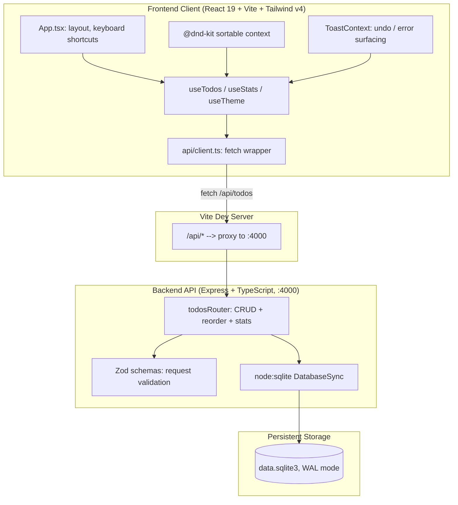
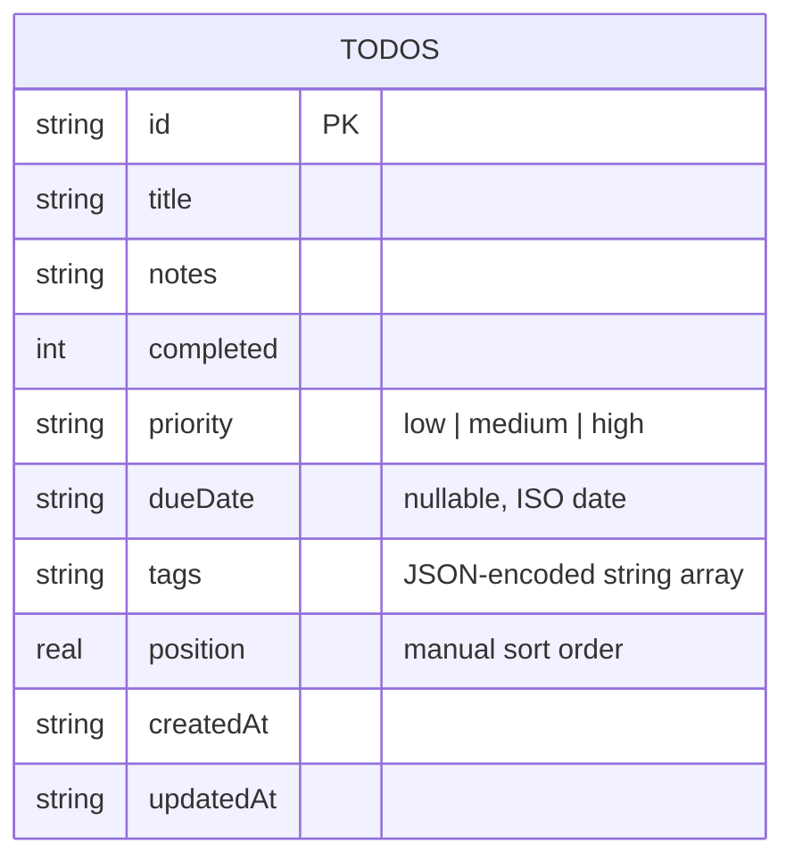

# Flow — System Architecture & Design Document

> Written retroactively after implementation, to document the decisions the agent made while executing the assignment prompt.

## 1. Executive Overview

Flow is an end-to-end dynamic todo list application built to demonstrate an industry-standard task management UX in a small, honestly-scoped surface area: one entity (the task), a REST API, and a React client with optimistic updates, drag-and-drop, filtering/search/sort, and dark mode. Unlike a feature-maximalist build, every capability listed here is implemented and verified — nothing is aspirational.

---

## 2. System Architecture

**Why this shape:** no ORM, no message queue, no SSE — a todo list's consistency model is "the server is the source of truth, the client optimistically predicts it." That's fully satisfiable with a synchronous REST API and a single-writer embedded database.

---

## 3. Data Model & Database Schema

A single `todos` table. No categories/subtasks/tags-as-entities — tags are stored as a JSON array column, which is the right tradeoff at this scale (avoids a join for a feature that's purely descriptive, never queried by relation).

`position` is a float, not an integer index, so a drag-and-drop reorder only ever needs to update the moved row's neighbors — no cascading renumber of the whole table.

---

## 4. Component Hierarchy & Module Breakdown

### 4.1 Frontend
- **`App.tsx`** — top-level layout, global keyboard shortcuts (`N` / `/` / `Esc`), wires hooks to components.
  - **`AddTodoForm.tsx`** — single-line quick-add that expands in place for priority/due-date/tags.
  - **`FilterBar.tsx`** — search input (debounced), status tabs, priority toggles, tag pills, sort `<select>`.
  - **`StatsBar.tsx`** — live progress bar + overdue count, backed by `useStats`.
  - **`TodoList.tsx`** — `@dnd-kit` `DndContext` + `SortableContext`; owns drag-end reorder logic.
    - **`TodoItem.tsx`** — checkbox, inline title editing, expand/collapse for notes/priority/due-date, drag handle.
    - **`EmptyState.tsx`** / **`Skeleton.tsx`** — contextual empty states and loading placeholders.
  - **`ToastContainer.tsx`** — renders `ToastContext` state; delete-undo lives here.
- **Hooks**:
  - **`useTodos.ts`** — owns todo list state, all mutations (add/update/delete/reorder/clearCompleted), each with optimistic apply + rollback-on-failure.
  - **`useStats.ts`** — separately fetches `/api/todos/stats` so stats reflect the *unfiltered* total, not the currently-filtered view.
  - **`useTheme.ts`** — light/dark state, `prefers-color-scheme` default, `localStorage` persistence.
- **`api/client.ts`** — thin `fetch` wrapper; one `request<T>()` helper all endpoint functions funnel through.

### 4.2 Backend
- **`index.ts`** — Express app, CORS, JSON body parsing, error handler.
- **`db.ts`** — `node:sqlite` `DatabaseSync` setup, WAL mode, first-run seed data.
- **`routes/todos.ts`** — all seven endpoints (see §6), each request validated with a Zod schema before touching the database.

---

## 5. Key Technical Decisions

- **`node:sqlite` instead of `better-sqlite3`.** The original plan was `better-sqlite3`, but its native build failed on this machine (`node-gyp` couldn't find a Visual Studio C++ toolchain). Rather than asking the user to install a multi-gigabyte build toolchain for a todo app, the agent switched to Node's built-in `node:sqlite` module (stable in Node 22+, no native compilation). One real API difference surfaced during this: `node:sqlite`'s named-parameter binding throws on object keys not present in the query (`better-sqlite3` silently ignores extras) — this caused a live bug in the `PATCH` handler that was caught and fixed during smoke testing.
- **Optimistic UI with rollback.** Every mutation in `useTodos.ts` updates local state immediately, then reconciles with (or rolls back to the pre-mutation snapshot on failure from) the server response — the UI never waits on a round-trip to feel responsive.
- **Server-side filtering/sorting, not client-side.** Search, status/priority/tag filters, and sort mode are all query parameters resolved in SQL (`routes/todos.ts`), not `.filter()`/`.sort()` in the browser — this keeps behavior correct if data volume grows and keeps the "what does the URL/request represent" story simple.
- **`204 No Content` → `200 { ok: true }` on delete.** Found via a Chrome DevTools Protocol audit (see below): a `204` response to `DELETE` was logged as `net::ERR_ABORTED` in Chromium's Network panel — a known benign quirk for empty-body responses over keep-alive connections, confirmed harmless (DB stayed consistent, JS `fetch()` resolved fine) but noisy for anyone inspecting the app in DevTools. Switched to `200` with a small JSON body, which doesn't hit the quirk at all.

---

## 6. API Specification

| Method | Endpoint | Description |
|---|---|---|
| `GET` | `/api/todos` | List todos; query params `search`, `completed`, `priority`, `tag`, `sort` |
| `GET` | `/api/todos/stats` | `{ total, completed, active, overdue }` for the whole table |
| `POST` | `/api/todos` | Create a todo (Zod-validated) |
| `PATCH` | `/api/todos/:id` | Partial update — title, notes, completed, priority, dueDate, tags |
| `DELETE` | `/api/todos/:id` | Delete one todo |
| `POST` | `/api/todos/reorder` | Persist drag-and-drop order (`{ orderedIds: string[] }`), wrapped in a transaction |
| `DELETE` | `/api/todos/completed` | Bulk-delete all completed todos |

---

## 7. Verification & Acceptance Criteria

All of the following were actually run against the live app, not asserted from reading the code:

- `curl` smoke tests of every endpoint (create, list, filter, patch, reorder, bulk-delete) against the running server.
- `tsc --noEmit` clean on both `client/` and `server/` after every source change.
- End-to-end browser verification via headless Chromium (Playwright): add → complete → dark mode → search → expand/edit → drag-and-drop reorder, each confirmed with a screenshot and a `console --errors`-equivalent check.
- A dedicated Chrome DevTools Protocol audit (navigation/paint timing, `Performance.getMetrics`, full request/response log, console messages) — used to find and fix the `ERR_ABORTED` issue documented in §5.
- Data-integrity check: after the DELETE fix, queried `/api/todos` directly to confirm no orphaned or duplicated rows from the failed/retried test runs.
