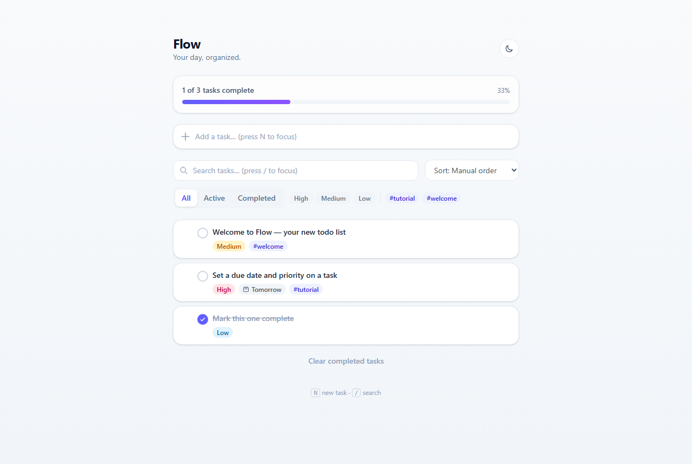
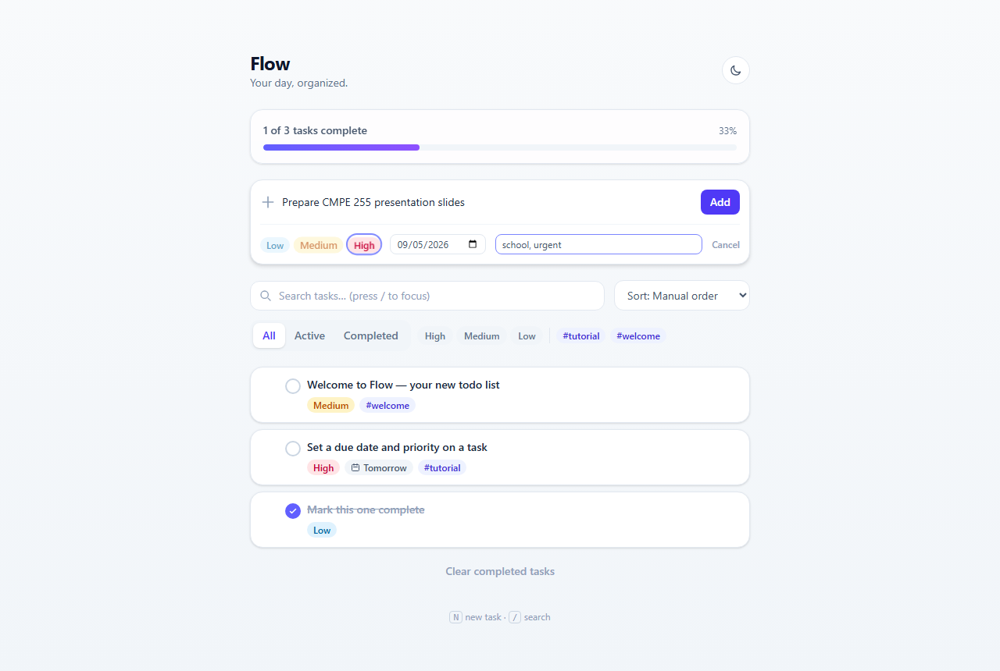
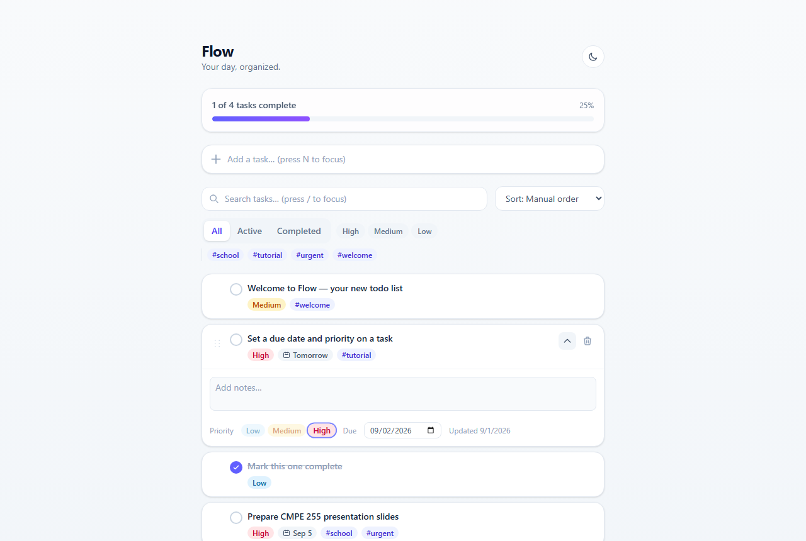
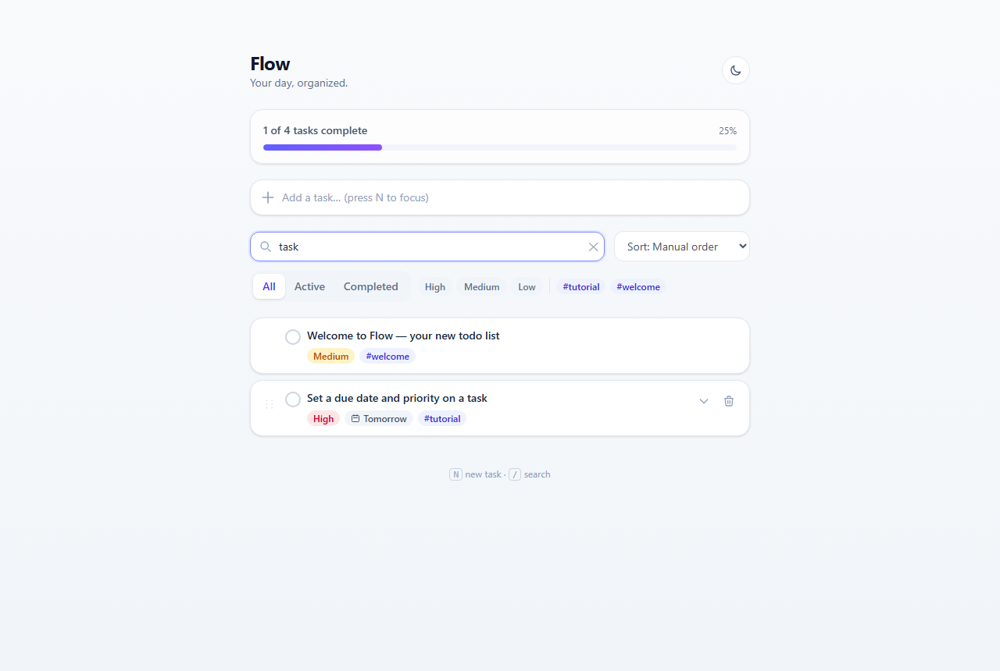
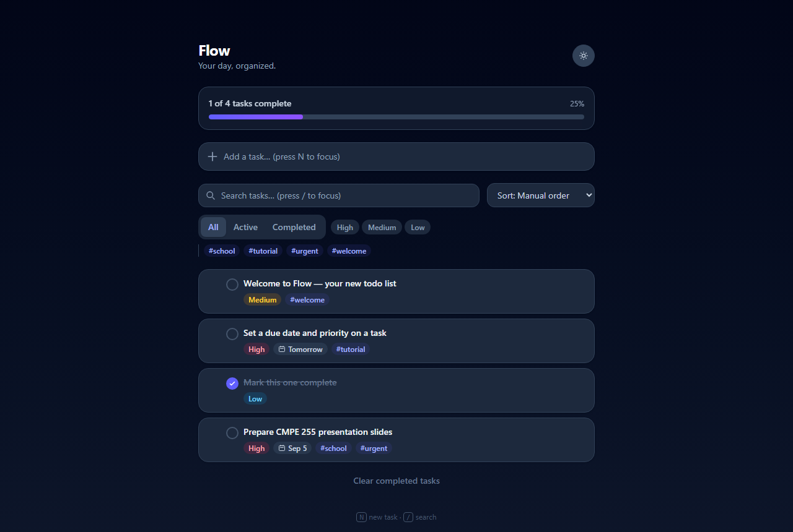
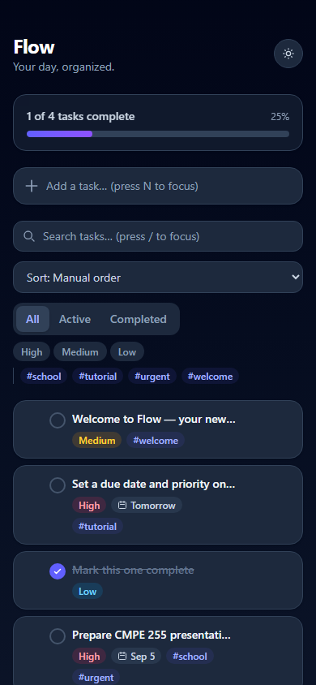

# ✅ Flow — A Modern Dynamic Todo Workspace

A full-stack, end-to-end dynamic todo list application built with an emphasis on industry-standard UX: optimistic updates, drag-and-drop reordering, keyboard-first navigation, dark mode, and real persistence via a REST API backed by SQLite.

---

## 📸 Visual Tour

### 1. List View & Live Progress
*Priority chips, due-date badges, tag pills, and a live completion progress bar that updates instantly on every change.*


### 2. Quick-Add With Expandable Details
*A single-line quick-add expands in place to capture priority, due date, and comma-separated tags without leaving the flow.*


### 3. Inline Task Detail Editing
*Click a task to expand it: edit notes, re-assign priority, change the due date, and see the last-updated timestamp — all inline, no modal.*


### 4. Search, Status, Priority & Tag Filtering
*Debounced full-text search combined with status tabs, priority toggles, and tag filters — all server-queried, not client-side hacks.*


### 5. Dark Mode
*System-preference-aware theme that persists across sessions, with every surface (badges, inputs, toasts) fully re-themed.*


### 6. Responsive Mobile Layout
*Single-column, touch-friendly layout that holds up from desktop down to a phone viewport.*


---

## ✨ Feature Set

- Full CRUD with **optimistic UI updates** that roll back automatically on network failure
- **Drag-and-drop** manual reordering (via `@dnd-kit`), persisted to the database
- Priorities (low/medium/high), due dates with **overdue highlighting**, and free-form tags
- Inline editing: click a title to rename in place, expand a task for notes/priority/due-date edits
- Debounced search, status filter (all/active/completed), priority filter, tag filter
- Five sort modes: manual order, due date, priority, recently added, alphabetical
- **Delete with Undo** toast notifications; bulk "Clear completed"
- Live stats bar (total / active / overdue) and animated progress bar
- **Dark mode** with system-preference detection, persisted to `localStorage`
- Keyboard shortcuts — `N` focuses quick-add, `/` focuses search, `Esc` blurs
- Loading skeletons and contextual empty states (no tasks / no results / all done)
- Fully responsive, mobile-first layout

---

## 🏛️ System Architecture

* **Frontend**: React 19, TypeScript, Vite, Tailwind CSS v4, `@dnd-kit` for drag-and-drop.
* **Backend**: Express.js REST API written in TypeScript.
* **Storage**: SQLite via Node's built-in `node:sqlite` driver — zero native build step, zero external services.
* **Data flow**: client optimistically mutates local state, calls the REST API, and reconciles with the server response (or rolls back on error).

---

## 🚀 Quick Start

Requires Node.js 22+ (uses the built-in `node:sqlite` module).

```bash
# Backend Server (Port 4000)
cd server
npm install
npm run dev

# Frontend Client (Port 5173)
cd client
npm install
npm run dev # Open http://localhost:5173/
```

The Vite dev server proxies `/api` to the backend, so no CORS setup is needed. On first run, the server seeds a few example tasks into `server/data.sqlite3` — delete that file to reset.

See [`DESIGN_DOC.md`](./DESIGN_DOC.md) for the full architecture and key technical decisions.
