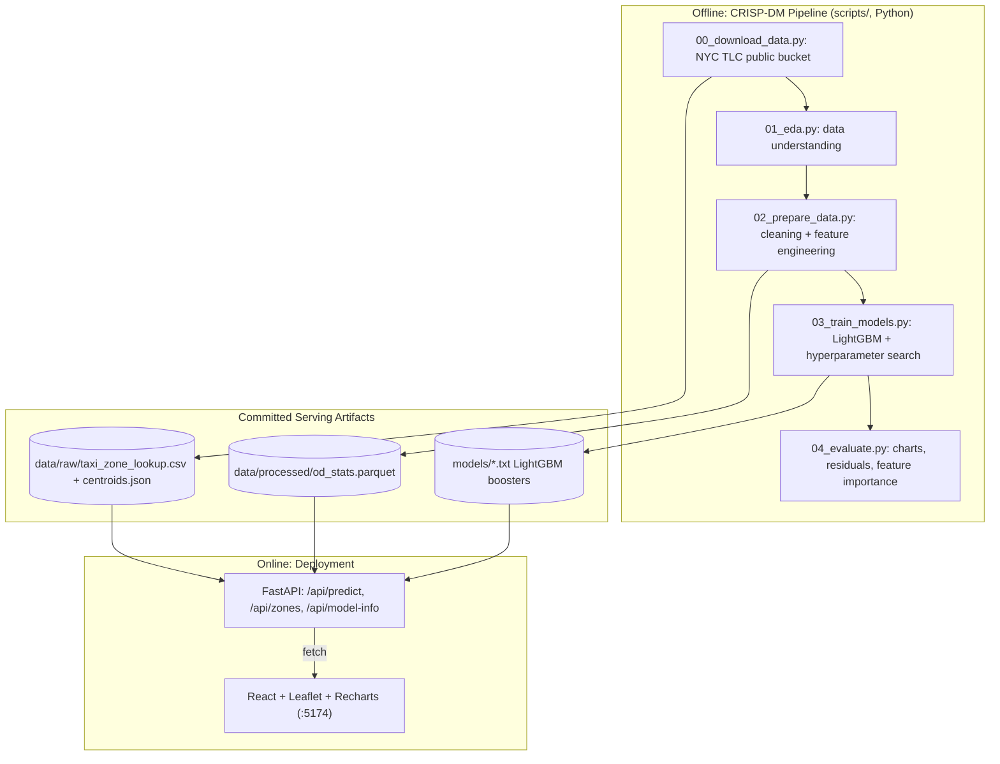

# NYC Taxi Trip Estimator — System Architecture & Design Document

> See [`docs/01_business_understanding.md`](./docs/01_business_understanding.md) for the CRISP-DM Phase 1 writeup.

## 1. Executive Overview

A rider-facing trip estimator: pick a pickup zone, a dropoff zone, and a time, and get a predicted duration and fare — backed by two LightGBM models trained on ~2.4M real NYC TLC Yellow Taxi trips, deployed behind a REST API, with a full model-insights dashboard for auditability.

---

## 2. System Architecture

**Why offline/online is split this way:** training on 2.4M rows takes ~2 minutes total — there's no reason to do it per-request. The API loads pre-trained boosters and static lookup tables at startup and serves predictions in milliseconds; retraining is a deliberate, separate step (`scripts/03_train_models.py`), not something that happens on the request path.

---

## 3. Data Model

No database — this is a batch-trained, file-served system. The three artifacts the API depends on at runtime:

| Artifact | Built by | Used for |
|---|---|---|
| `models/duration_model.txt`, `models/fare_model.txt` | `03_train_models.py` | LightGBM `Booster` — the actual predictions |
| `models/category_maps.json`, `feature_cols.json` | `03_train_models.py` | Rebuilding identical categorical dtype codes at serving time (LightGBM requires this to match training exactly) |
| `data/processed/od_stats.parquet` | `02_prepare_data.py` | Historical avg duration/fare/distance per (pickup zone, dropoff zone) pair with ≥5 trips — shown alongside the model prediction as a sanity check |
| `data/raw/taxi_zone_lookup.csv`, `taxi_zone_centroids.json` | `00_download_data.py`, `convert_zones_to_geojson.py` | Zone names/boroughs and lat/lon centroids, for feature-building and the `/api/zones` endpoint |

---

## 4. Component Hierarchy

### 4.1 ML Pipeline (`scripts/`)
- **`00_download_data.py`** — fetches raw parquet + zone shapefile from NYC TLC's public bucket.
- **`convert_zones_to_geojson.py`** — reprojects the zone shapefile (NY State Plane ft → WGS84) using `pyproj`, computes centroids via the shoelace formula, using `pyshp` (pure Python, no GDAL dependency).
- **`simplify_geojson.py`** — Douglas-Peucker polygon simplification (hand-implemented, no extra dependency) — cuts the zone GeoJSON from 4MB to 371KB for the frontend.
- **`01_eda.py`** — profiles missingness, date-range anomalies, target distributions; writes `docs/eda/eda_findings.json` + a chart.
- **`02_prepare_data.py`** — cleaning rules (justified by `01_eda.py`'s findings) + feature engineering restricted to pre-trip-available signals; time-based train/test split (last ~20% of days held out, so no future OD-pair pattern leaks backward).
- **`03_train_models.py`** — trains each target against a naive mean-baseline, with a 5-configuration LightGBM random hyperparameter search, logging every trial (not just the winner) to `docs/eda/model_search_log.json`.
- **`04_evaluate.py`** — turns that log into predicted-vs-actual, residual, and feature-importance charts.

### 4.2 Backend (`backend/app/`)
- **`predict.py`** — `TaxiModelService`: loads both boosters once (`lru_cache`), rebuilds the exact training-time feature pipeline for a single request (borough lookup, haversine distance, rush-hour/weekend flags, airport-zone detection), and returns predictions enriched with historical OD-pair stats.
- **`main.py`** — FastAPI routes; `schemas.py` — Pydantic request/response models.

### 4.3 Frontend (`frontend/src/`)
- **`App.tsx`** — tab switcher between Estimator and Model Insights.
- **`components/TripMap.tsx`** — Leaflet map rendering all 263 zones as a color-coded (by borough) GeoJSON layer; click-to-select pickup then dropoff.
- **`components/EstimatorPage.tsx`** — ties the map, zone dropdowns, datetime/passenger inputs, and `/api/predict` together.
- **`components/ModelInsightsPage.tsx`** + **`TargetReportCard.tsx`** — renders `/api/model-info`: dataset stats, data-quality-issue table, and per-model hyperparameter-search / feature-importance charts (`recharts`).

---

## 5. Key Technical Decisions

- **`trip_distance` is deliberately excluded as a model feature.** The raw TLC data includes the taxi meter's actual trip distance — an extremely strong predictor of both duration and fare. But a rider requesting an *estimate* hasn't taken the trip yet; the meter hasn't run. Training on it would leak the answer during offline evaluation and then silently be unavailable in production (train/serve skew). In its place: **haversine distance between zone centroids**, computed identically at training and serving time from a static lookup, plus a historical avg-distance-by-OD-pair feature shown as context (not fed to the model) — both are legitimately known before a trip starts.
- **Zone-level, not lat/lon-level.** NYC TLC anonymized pickup/dropoff to 263 named zones (not exact coordinates) starting in 2016, for rider privacy. The whole system — map, features, predictions — works at that granularity; there's no way to get exact addresses from this data source, and pretending otherwise would misrepresent precision.
- **Time-based train/test split**, not random. A random split would let the model see OD-pair patterns from the last week of January while "predicting" the first week — an optimistic leak for any time-correlated feature. Splitting by day-of-month (first ~80% train, last ~20% test) is the honest evaluation.
- **Logged hyperparameter search, not just the winning config.** `03_train_models.py` records every trial's params and validation RMSE, not only the best model — so the Model Insights dashboard can show the *search*, including how much (or little) tuning actually mattered versus the baseline.
- **LightGBM over a neural net.** ~2.4M rows of structured, mixed categorical/numeric tabular data is exactly gradient-boosted trees' strong suit — trains in seconds per configuration on CPU, handles categoricals (zone IDs, boroughs) natively without embeddings, and is far more interpretable (feature importance, monotonic behavior) than a neural approach would be for no accuracy benefit at this data scale.

---

## 6. API Specification

| Method | Endpoint | Description |
|---|---|---|
| `GET` | `/api/health` | Liveness check |
| `GET` | `/api/zones` | All 263 taxi zones with borough, service zone, and centroid lat/lon |
| `POST` | `/api/predict` | `{pickup_location_id, dropoff_location_id, pickup_datetime, passenger_count}` → predicted duration/fare + historical OD-pair stats |
| `GET` | `/api/model-info` | Full CRISP-DM artifact bundle: EDA findings, data-prep summary, hyperparameter search log, feature importance, test metrics — for both models |
| `GET` | `/api/autoresearch` | 4-phase AutoResearch telemetry: backbone tournament, feature-transform search, hill-climbing path, blending, full-data finalization outcome, literature benchmark — see [`RESEARCH_REPORT.md`](./RESEARCH_REPORT.md) |

---

## 7. Verification & Acceptance Criteria

- `curl http://localhost:8001/api/health` and `/api/zones` return HTTP 200 with structured JSON (263 zones).
- `/api/predict` verified against a real, checkable case: JFK Airport → Midtown Manhattan returns a fare estimate (~$69) matching NYC's well-known ~$70 JFK flat-rate fare (also visible as a distinct spike in the raw fare-amount distribution during EDA) — a good sign the model learned something real, not noise.
- Frontend verified end-to-end via headless Chromium: zone selection (map + dropdown), estimate submission, and the full Model Insights dashboard, all with **0 console errors and 0 failed network requests**.
- Held-out test-set metrics (not just validation) reported for both models: duration R²=0.788, fare R²=0.929.
