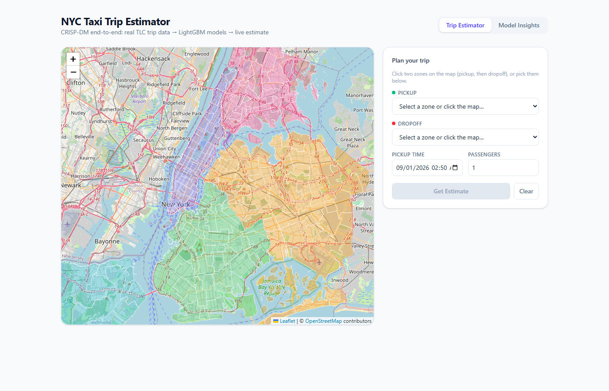
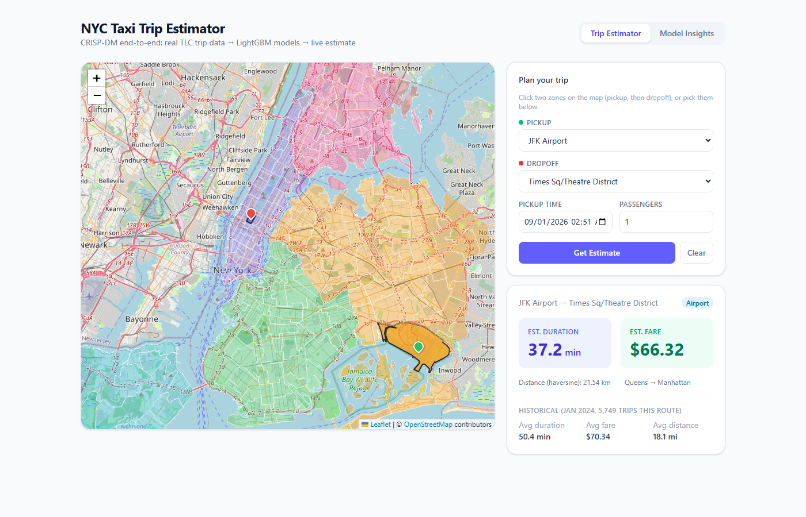
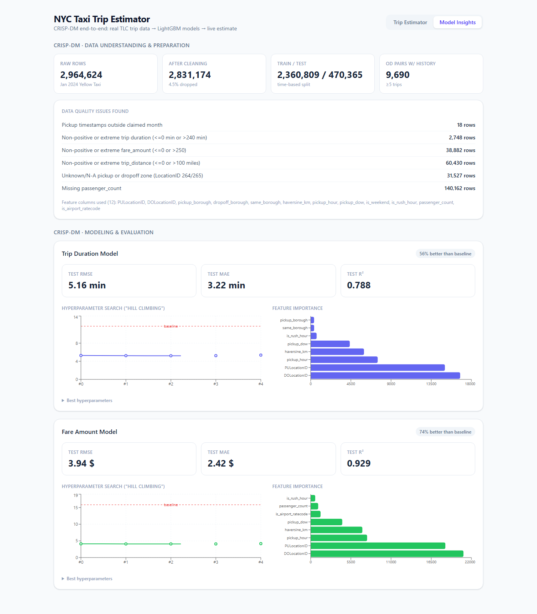
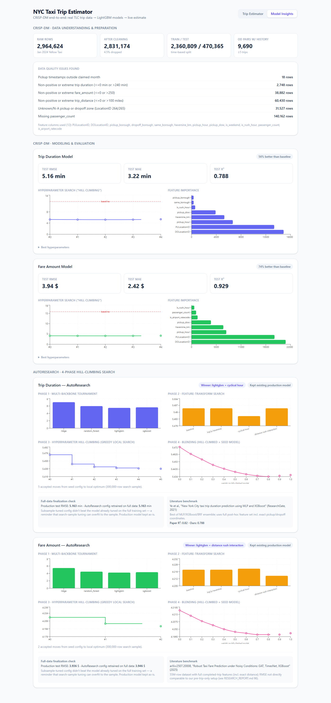

# 🚕 NYC Taxi Trip Duration & Fare Prediction

An end-to-end data science project, built following CRISP-DM: real NYC TLC trip data → cleaned and feature-engineered → two LightGBM regression models (trip duration, fare amount) with a logged hyperparameter search → deployed behind a FastAPI backend → an interactive-map React frontend that gives a live trip estimate, plus a full model-insights dashboard.

---

## 📸 Visual Tour

### 1. Interactive Map — Pickup/Dropoff Selection
*263 real NYC TLC taxi zones, colored by borough, clickable directly on the map or via searchable dropdowns.*


### 2. Live Trip Estimate
*Model prediction alongside the honest historical baseline for that exact zone pair — so you can see how the model compares to reality, not just trust a number.*


### 3. Model Insights Dashboard
*Every CRISP-DM artifact a data scientist would want to audit: data quality issues found, cleaning impact, hyperparameter search ("hill climbing") vs. a naive baseline, feature importance, and held-out test metrics — for both models.*


### 4. AutoResearch — 4-Phase Hill-Climbing Search
*Multi-backbone tournament, feature-transform search, greedy hyperparameter hill-climbing, and blending — full telemetry, plus a literature-benchmark comparison. See [`RESEARCH_REPORT.md`](./RESEARCH_REPORT.md) for the full writeup.*


---

## 🏛️ System Architecture

* **Data source**: [NYC TLC Yellow Taxi Trip Records](https://www.nyc.gov/site/tlc/about/tlc-trip-record-data.page), January 2024 (~2.96M trips) — the same underlying data as the Kaggle NYC Taxi competitions, fetched directly with no API key required.
* **ML pipeline**: Python, pandas, LightGBM/XGBoost/scikit-learn — see `scripts/` for the full CRISP-DM pipeline (download → EDA → clean/feature-engineer → train → evaluate → AutoResearch).
* **Backend**: FastAPI serving `/api/predict`, `/api/zones`, `/api/model-info`, `/api/autoresearch`.
* **Frontend**: React 19 + TypeScript + Vite + Tailwind CSS v4, `react-leaflet` for the map, `recharts` for the dashboard.

## CRISP-DM Phases

| Phase | Artifact |
|---|---|
| 1. Business Understanding | [`docs/01_business_understanding.md`](./docs/01_business_understanding.md) |
| 2. Data Understanding | `scripts/01_eda.py` → [`docs/eda/eda_findings.json`](./docs/eda/eda_findings.json), [`eda_overview.png`](./docs/eda/eda_overview.png) |
| 3. Data Preparation | `scripts/02_prepare_data.py` → [`docs/eda/prep_summary.json`](./docs/eda/prep_summary.json) |
| 4. Modeling | `scripts/03_train_models.py` (LightGBM + logged hyperparameter search) |
| 5. Evaluation | `scripts/04_evaluate.py` → [`docs/eda/evaluation_*.png`](./docs/eda/), served live via `/api/model-info` and the Model Insights tab |
| 6. Deployment | `backend/` (FastAPI) + `frontend/` (React) |

Full architecture, data model, and key decisions (notably: why `trip_distance` is *not* a model feature) are in [`DESIGN_DOC.md`](./DESIGN_DOC.md). The full research writeup — including the AutoResearch hill-climbing search and literature benchmark comparison — is in [`RESEARCH_REPORT.md`](./RESEARCH_REPORT.md).

## Results

| Target | Test RMSE | Test MAE | Test R² | vs. naive baseline |
|---|---:|---:|---:|---:|
| Trip duration | 5.16 min | 3.22 min | 0.788 | 56% lower RMSE |
| Fare amount | $3.94 | $2.42 | 0.929 | 74% lower RMSE |

Both models use **only pre-trip-available features** (pickup/dropoff zone, requested time) — no exact trip distance, since that isn't known before a trip happens. See [`DESIGN_DOC.md §5`](./DESIGN_DOC.md#5-key-technical-decisions) for why.

---

## 🚀 Quick Start

Requires Python 3.11+ and Node.js 22+.

```bash
# 1. Get the data (downloads ~50MB from NYC TLC's public bucket, no auth needed)
cd 01_nyc_taxi_trip_prediction
pip install -r backend/requirements.txt pyshp pyproj matplotlib scikit-learn
python scripts/00_download_data.py
python scripts/convert_zones_to_geojson.py
python scripts/simplify_geojson.py

# 2. Run the CRISP-DM pipeline
python scripts/01_eda.py
python scripts/02_prepare_data.py
python scripts/03_train_models.py
python scripts/04_evaluate.py

# 2b. Optional: AutoResearch hill-climbing search (requires xgboost)
pip install xgboost
python scripts/05_autoresearch.py
python scripts/06_finalize_autoresearch.py

# 3. Backend (port 8001)
cd backend
uvicorn app.main:app --port 8001

# 4. Frontend (port 5174), in a separate terminal
cd frontend
npm install
npm run dev   # Open http://localhost:5174/
```

The trained models, taxi zone lookup/centroids, and OD-pair historical stats are committed to the repo (`models/`, small `data/raw`/`data/processed` files) so steps 3–4 work immediately without re-running the pipeline. Re-run steps 1–2 only if you want to retrain from scratch or refresh the data.
