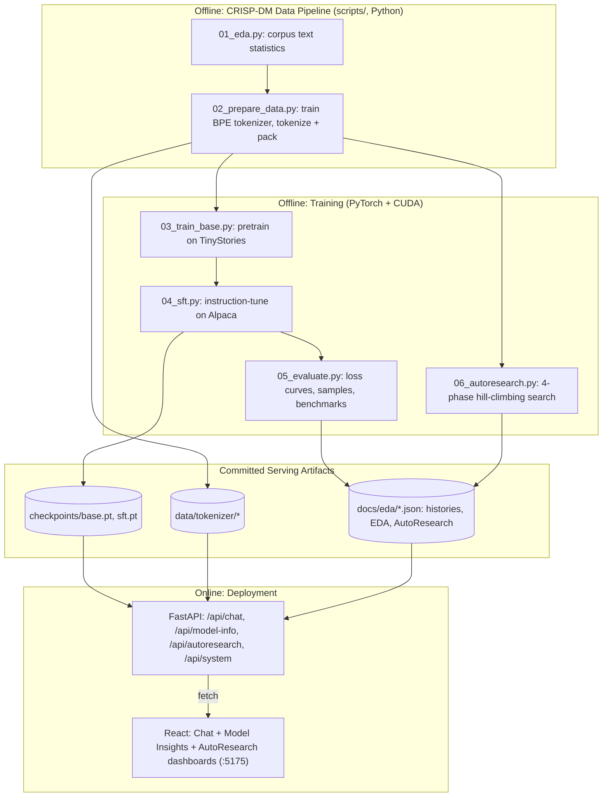

# NanoLlama — System Architecture & Design Document

> See [`docs/01_business_understanding.md`](./docs/01_business_understanding.md) for the CRISP-DM Phase 1 writeup. Architecture and methodology were implemented independently — the reference repo for this assignment was consulted only to confirm which public datasets it used (TinyStories, a conversational/QA set), not for any code, class design, or algorithm.

## 1. Executive Overview

NanoLlama is a ~30M-parameter decoder-only transformer, built from scratch in PyTorch with current-generation architecture primitives (RoPE, RMSNorm, SwiGLU, tied embeddings), pretrained on TinyStories and instruction-tuned on Alpaca — the full modern LLM recipe (pretrain → SFT → serve), sized to actually fit and finish training on a single 4GB laptop GPU rather than promising more than the hardware can deliver.

---

## 2. System Architecture

**Why train/serve is split this way:** training (even at this small scale) is GPU-bound and takes minutes; the API loads finished checkpoints and serves chat completions in milliseconds. Retraining is a deliberate, separate, monitored step — never something that happens on a request path.

---

## 3. Model Architecture

| Component | Choice | Why (vs. the pre-2020 default) |
|---|---|---|
| Position encoding | **RoPE** (Su et al. 2021) | Rotary embeddings encode relative position directly in the attention dot-product, generalize better to sequences longer than seen in training, and add zero extra parameters — vs. learned absolute position embeddings, which are fixed-length and purely additive. |
| Normalization | **RMSNorm** (Zhang & Sennrich 2019) | Drops LayerNorm's mean-centering (re-centering invariance isn't needed for transformers in practice) — fewer ops, faster, comparable or better stability. |
| Feed-forward | **SwiGLU** (Shazeer 2020) | A gated linear unit with the Swish/SiLU activation consistently outperforms plain ReLU/GELU MLPs at matched parameter count — the same primitive LLaMA, PaLM, and most 2023+ open LLMs use. |
| Embeddings | **Tied** input/output (Press & Wolf 2017) | Input and output embeddings solve related problems (mapping between tokens and a shared representation space); tying them saves `vocab_size × d_model` parameters — meaningful at this scale (~4.2M of ~30M total). |
| Attention | Causal self-attention via `F.scaled_dot_product_attention` | Uses PyTorch's fused/flash-attention kernel automatically on supported hardware — no need to hand-write a slower explicit-softmax version. |

**Code default** (`model/nanollama.py::NanoLlamaConfig`): `d_model=512, n_layers=8, n_heads=8, vocab_size=8192, context_length=384` → ~29.5M parameters — the reasonable-first-guess config used for the initial pretraining run. **Deployed model**: AutoResearch's shape/hyperparameter search (§5, `RESEARCH_REPORT.md §4`) found `n_layers=4` (same width) beats the 8-layer default on held-out validation loss at full training budget — 16.8M params, *fewer* than the default, with *better* perplexity (6.73 vs. 7.45). That configuration was automatically redeployed as `checkpoints/base.pt`; the class default is left at 8 layers in code as the sensible starting point a search should be run against, not silently changed to match whatever the last search happened to find.

---

## 4. Data Pipeline

- **Pretraining corpus**: [TinyStories](https://arxiv.org/abs/2305.07759) (Eldan & Li, 2023) — 27,630 short children's stories, ~22.5M characters, restricted vocabulary (~6,450 unique words in a 5,000-story sample, per EDA). Chosen *because* it's simple: the TinyStories paper's central finding is that models with as few as 1–33M parameters generate fluent, coherent text when trained on simple, curated data — which is exactly the constraint this project is under.
- **Tokenizer**: byte-level BPE, `vocab_size=8192`, trained from scratch on the TinyStories corpus (not reusing GPT-2's 50K vocab — the restricted-vocabulary corpus doesn't need it, and a smaller vocab means a smaller, cheaper embedding table).
- **SFT corpus**: [Stanford Alpaca](https://github.com/tatsu-lab/stanford_alpaca) (Taori et al. 2023), 52,002 instruction/response pairs. The full set is used (51,002 train / 1,000 val) — an earlier 8,000-example subset trained for only 600 steps proved insufficient (<1.3 epochs) and produced low-quality output; see `RESEARCH_REPORT.md §8` for the diagnosis and fix.
- **Loss masking**: SFT sequences are `prompt_tokens + response_tokens`, but the loss is computed **only on response tokens** (`loss_mask` in `model/nanollama.py::forward`) — the model should learn to *generate* good responses, not to predict the fixed instruction template that precedes them.

---

## 5. Key Technical Decisions

- **Batch size was picked empirically against this exact GPU, not assumed.** An early timing run at the "obvious" default (`batch_size=64, context_length=384`) silently stalled — GPU utilization sat at 100% but progress nearly froze. Root cause, found via a targeted memory diagnostic: that configuration needs **4.52GB** of VRAM, which is *just* over this laptop's 4.00GB. When PyTorch's allocation exceeds dedicated VRAM by even a little, Windows can fall back to a "shared GPU memory" pool backed by system RAM over PCIe — technically not an OOM crash, but 10-50x slower, which looks exactly like a hang. Every batch size in every training/search script in this project (`03_train_base.py`, `04_sft.py`, `06_autoresearch.py`) was subsequently chosen from an explicit memory/throughput sweep (`batch_size=16` for real training runs, `24` for AutoResearch's smaller proxy models), keeping peak usage under ~2.5GB with real headroom. This is the single most important practical lesson of the project: *"does the config fit in VRAM" is an empirical question on a specific machine, not something to assume from parameter count alone.*
- **AutoResearch phases are proxy-scale, not full-scale.** Each of the ~15-20 architecture/hyperparameter trials in `06_autoresearch.py` trains for only 250 steps on a 256-token context — enough to see which configuration is *directionally* better, at a fraction of the cost of full training. This mirrors the taxi project's AutoResearch design (search fast, finalize properly) and keeps the entire search bounded to minutes.
- **Multi-turn conversation is explicitly not supported.** Alpaca is single-turn instruction→response data; the SFT model was never shown a multi-turn conversation. Rather than pretend the chat UI supports multi-turn memory it doesn't have, `backend/app/generate.py` only feeds the most recent user message to the model — documented, not hidden.
- **`bf16` autocast, not `fp16` with a gradient scaler.** Ampere (RTX 3050 Ti's architecture, compute capability 8.6) supports `bf16` natively; it has fp32's exponent range (no overflow/underflow risk requiring a `GradScaler`) with fp16's memory/speed benefits — strictly simpler and safer than fp16 mixed precision for a training loop this size.

---

## 6. API Specification

| Method | Endpoint | Description |
|---|---|---|
| `GET` | `/api/health` | Liveness check |
| `GET` | `/api/system` | GPU/hardware/framework info (device name, VRAM, CUDA/PyTorch versions, bf16 support) |
| `POST` | `/api/chat` | `{messages, temperature, top_p, max_new_tokens}` → generated reply + generation-speed telemetry |
| `GET` | `/api/model-info` | Full CRISP-DM artifact bundle: EDA, data-prep summary, base + SFT training histories, qualitative evaluation samples |
| `GET` | `/api/autoresearch` | 4-phase AutoResearch telemetry: architecture tournament, shape search, hill-climbing path, model-soup result |

---

## 7. Verification & Acceptance Criteria

- Architecture smoke-tested before any training: forward pass, backward pass, and autoregressive generation all verified on a freshly-initialized model, with initial loss matching the theoretical value (`ln(vocab_size) ≈ 9.01` for `vocab_size=8192`) — confirms correct initialization and loss computation before spending any GPU time on real training.
- Full base + SFT training histories (loss, validation perplexity, LR schedule, GPU memory, tokens/sec) logged step-by-step, not just final numbers — served live via `/api/model-info` and rendered in the Model Insights dashboard.
- Qualitative generation samples from both the base and SFT checkpoints captured and displayed side-by-side, so coherence and instruction-following can be judged by eye, not just inferred from a loss number.
- AutoResearch's architecture tournament directionally validates every "state of the art primitive" claim in §3 against its pre-2020 alternative, on this exact corpus and hardware — not asserted from the papers alone.
