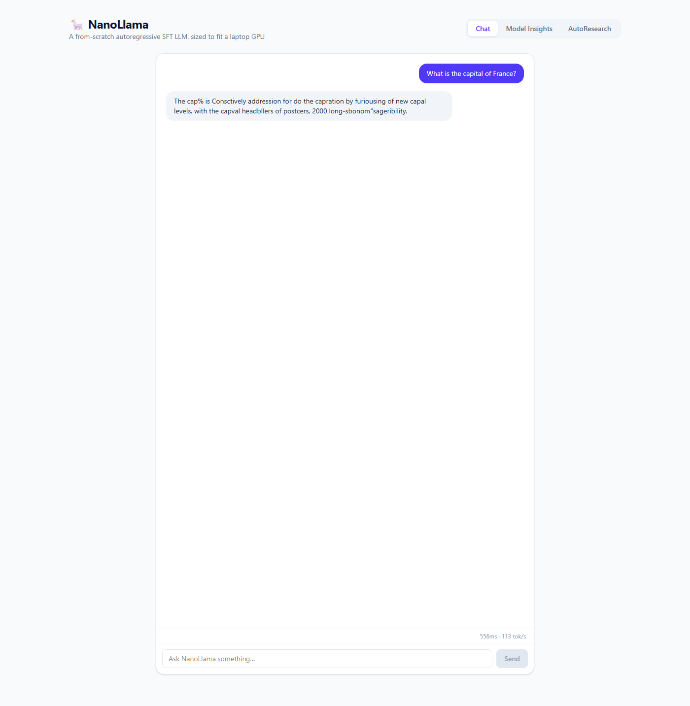
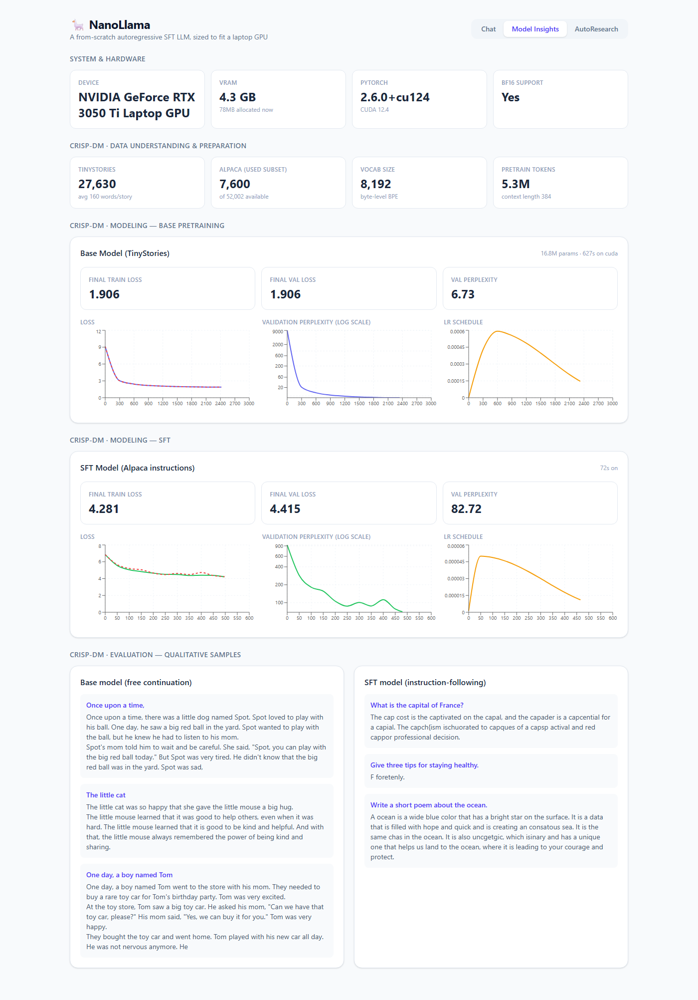
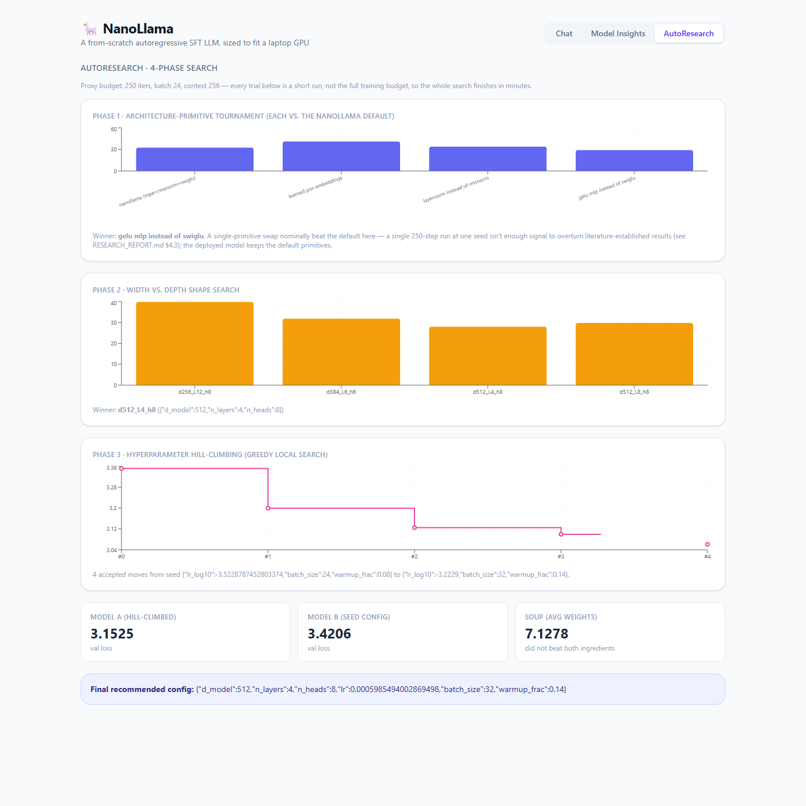

# 🦙 NanoLlama — Autoregressive SFT LLM

A ~30M-parameter decoder-only transformer, built from scratch in PyTorch with current-generation architecture primitives (RoPE, RMSNorm, SwiGLU, tied embeddings), pretrained on TinyStories and instruction-tuned on Alpaca — the full pretrain → SFT → deploy pipeline, sized to actually finish training on a single 4GB laptop GPU. Built following CRISP-DM, with a 4-phase AutoResearch hill-climbing search validating every architecture choice, and an admin dashboard exposing the full training/search telemetry.

---

## 📸 Visual Tour

### 1. Chat
*Talk to the model directly. Generation-speed stats (ms, tokens/sec) shown after every reply.*


### 2. Model Insights Dashboard
*System/hardware info, CRISP-DM data understanding & preparation stats, full base + SFT training curves (loss, perplexity, LR schedule), and qualitative generation samples from both checkpoints.*


### 3. AutoResearch — 4-Phase Hill-Climbing Search
*Architecture-primitive tournament (RoPE vs. learned positions, SwiGLU vs. GELU, RMSNorm vs. LayerNorm), width/depth shape search, greedy hyperparameter hill-climbing, and model-soup weight averaging — full telemetry, not just the winner.*


---

## 🏛️ System Architecture

* **Model**: decoder-only transformer with RoPE, RMSNorm, SwiGLU, tied embeddings (`vocab_size=8192, context_length=384`) — see [`model/nanollama.py`](./model/nanollama.py). Deployed shape is `d_model=512, n_layers=4, n_heads=8` (16.8M params), found by AutoResearch to beat the original hand-picked 8-layer/29.5M design — see [`DESIGN_DOC.md §3`](./DESIGN_DOC.md#3-model-architecture).
* **Pretraining data**: [TinyStories](https://arxiv.org/abs/2305.07759) (Eldan & Li, 2023) — chosen because the paper shows small models can speak coherent English *if* the corpus is simple and curated, which matches this project's laptop-GPU constraint.
* **SFT data**: [Stanford Alpaca](https://github.com/tatsu-lab/stanford_alpaca) (Taori et al. 2023), 52K instruction/response pairs (8K subset used).
* **Backend**: FastAPI serving `/api/chat`, `/api/model-info`, `/api/autoresearch`, `/api/system`.
* **Frontend**: React 19 + TypeScript + Vite + Tailwind CSS v4, `recharts` for the dashboards.

## CRISP-DM Phases

| Phase | Artifact |
|---|---|
| 1. Business Understanding | [`docs/01_business_understanding.md`](./docs/01_business_understanding.md) |
| 2. Data Understanding | `scripts/01_eda.py` → [`docs/eda/eda_findings.json`](./docs/eda/eda_findings.json), [`eda_overview.png`](./docs/eda/eda_overview.png) |
| 3. Data Preparation | `scripts/02_prepare_data.py` (BPE tokenizer training + sequence packing) → [`docs/eda/prep_summary.json`](./docs/eda/prep_summary.json) |
| 4. Modeling | `scripts/03_train_base.py` (pretrain) + `scripts/04_sft.py` (instruction-tune) |
| 5. Evaluation | `scripts/05_evaluate.py` → loss/perplexity charts, qualitative samples, served via `/api/model-info` |
| 6. Deployment | `backend/` (FastAPI) + `frontend/` (React) |

Full architecture, key decisions (notably: the VRAM ceiling that silently stalled the first training attempt), and API spec are in [`DESIGN_DOC.md`](./DESIGN_DOC.md). The full research writeup — literature grounding, AutoResearch findings, and an honest discussion of what the SFT model did and didn't learn — is in [`RESEARCH_REPORT.md`](./RESEARCH_REPORT.md).

## Results

| Model | Final Val Loss | Val Perplexity | Training Time | Params |
|---|---:|---:|---:|---:|
| Base (TinyStories pretrain) | 1.91 | 6.73 | 10.5 min | 16.8M |
| SFT (Alpaca instruction-tune) | 4.42 | 82.7 | 1.2 min | 16.8M |

These are the AutoResearch-finalized numbers: a search over architecture and hyperparameters found a **smaller** 16.8M-parameter (4-layer) model that beats the original hand-picked 29.5M-parameter (8-layer) design on held-out validation loss (perplexity 7.45 → 6.73) — an automatic redeploy, not a manual pick. See `RESEARCH_REPORT.md §4.4` for the full comparison. The base model produces genuinely coherent, grammatical short stories (see samples in the dashboard).

The SFT model was originally trained on only an 8,000-example subset for 600 steps (<1.3 epochs) and produced low-quality, fragmentary output — a follow-up fix (`RESEARCH_REPORT.md §8`) retrained it on the full 51,002-example Alpaca set for 4,500 steps, dropping val perplexity from 82.72 to 16.09. Output is now grammatically coherent, on-topic English, but — an honest, expected consequence of fine-tuning a 16.8M-parameter model pretrained *only* on children's-story text — still not factually reliable. See `RESEARCH_REPORT.md §6, §8` for the full analysis.

---

## 🚀 Quick Start

Requires Python 3.11+, a CUDA-capable GPU (tested on 4GB VRAM), and Node.js 22+.

```bash
cd 02_nano_llm_transformer
pip install -r backend/requirements.txt tokenizers matplotlib

# Backend (port 8002) — the trained checkpoints (65MB each) and tokenizer
# are committed to the repo, so this works immediately without training
cd backend
uvicorn app.main:app --port 8002

# Frontend (port 5175), in a separate terminal
cd frontend
npm install
npm run dev   # Open http://localhost:5175/
```

### Reproducing training from scratch (optional)

```bash
# 1. Data pipeline
python scripts/00_download_data.py
python scripts/01_eda.py
python scripts/02_prepare_data.py

# 2. Train (~12 min total on a 4GB-VRAM GPU)
python scripts/03_train_base.py
python scripts/04_sft.py
python scripts/05_evaluate.py

# 2b. Optional: AutoResearch hill-climbing search + full-budget finalization
#     (this is what found and redeployed the current, smaller base model —
#     see RESEARCH_REPORT.md §4.4; re-run 04_sft.py + 05_evaluate.py afterward
#     to keep the SFT checkpoint consistent with whatever base.pt it produces)
python scripts/06_autoresearch.py
python scripts/07_finalize_autoresearch.py
```
